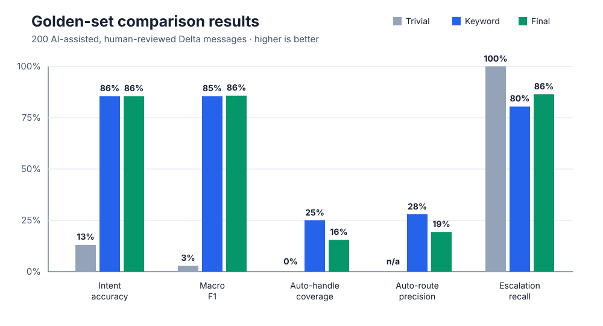
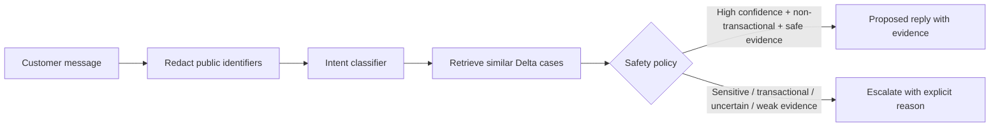
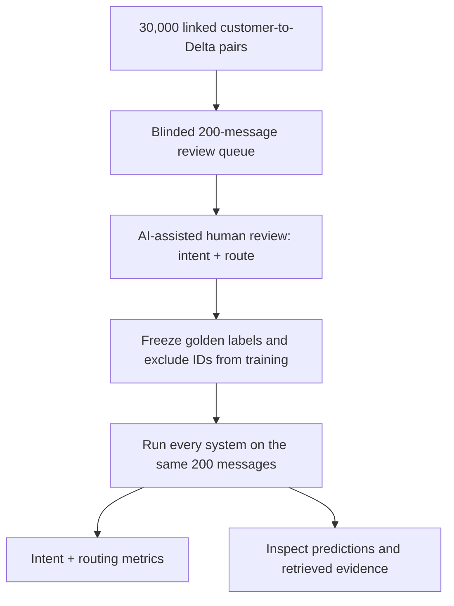

# Delta Support Agent

> An evidence-first AI triage assistant for Delta customer-support messages: classify the issue, retrieve comparable historical resolutions, draft a traceable reply, and decide when a human must take over.

Built as a submission for the Hiver SDE Intern take-home assignment using Delta conversations from Kaggle's [Customer Support on Twitter](https://www.kaggle.com/datasets/thoughtvector/customer-support-on-twitter) dataset.

<p>
  
  
  
  
</p>

## Reviewer summary

This is deliberately a **draft-and-route assistant**, not an autonomous airline-operations system. It is designed to make a support agent faster while retaining a human checkpoint for anything that could change a booking, expose private information, or require live operational data.

| Requirement | Evidence in this repository |
|---|---|
| Intent classification | Eight Delta-specific intents; final model reaches **85.7% macro F1** on the reviewed 200-message evaluation set. |
| Grounded drafting | Each prediction includes the retrieved historical customer messages and replies used as evidence. |
| Auto-handle vs. escalate | Every prediction has a decision and human-readable reason; transactional, sensitive, uncertain, and weak-evidence cases escalate. |
| Golden evaluation set | [`data/evaluation/golden.csv`](data/evaluation/golden.csv) contains 200 AI-assisted, human-reviewed labels. Golden IDs are excluded from training. |
| Baselines and tests | Trivial and keyword baselines, saved prediction files, JSON metrics, and **10 passing unit tests**. |

## Headline result — and the important caveat



| System | Intent accuracy | Macro F1 | Auto-handle coverage | Auto-route precision | Escalation recall |
|---|---:|---:|---:|---:|---:|
| Trivial: always `other_or_ambiguous`, escalate | 13.0% | 2.9% | 0.0% | n/a | 100.0% |
| Keyword rules | 85.5% | 85.5% | 25.0% | 28.0% | 80.4% |
| **Final: TF-IDF + logistic regression + retrieval + policy** | **85.5%** | **85.7%** | **15.5%** | **19.4%** | **86.4%** |

The final model is marginally better on intent F1 and escalation recall, but **19.4% auto-route precision is not safe enough for unattended sending**. The system should operate human-in-the-loop: a support agent reviews every escalation and every proposed response before it is sent. This is the most important finding of the project, not the F1 score.

## What happens to one message?



The eight intents are:

`booking_change_or_cancellation` · `baggage_issue` · `flight_disruption_or_status` · `check_in_or_boarding` · `refund_or_payment` · `loyalty_or_account` · `general_information` · `other_or_ambiguous`

The reply is copied from the closest compatible historical resolution rather than invented by an unconstrained generator. The app exposes that provenance so a reviewer can inspect it.

## Run it locally

Requirements: Python 3.10+ and roughly 1 GB of free disk space. The pipeline uses a fixed 30,000-pair Delta subset so a typical laptop can reproduce the headline results in about 15 minutes.

```bash
git clone https://github.com/AnshParmar123/hiver-delta-support-agent-submission.git
cd hiver-delta-support-agent-submission
python3 -m venv .venv
source .venv/bin/activate
pip install -r requirements.txt

curl --fail --location --output /tmp/twcs.zip \
  https://www.kaggle.com/api/v1/datasets/download/thoughtvector/customer-support-on-twitter
unzip -j /tmp/twcs.zip twcs/twcs.csv -d data/raw

hiver-support extract
hiver-support train --exclude-ids data/evaluation/golden.csv
hiver-support baseline --kind trivial --input data/evaluation/golden.csv --output data/evaluation/trivial.csv
hiver-support baseline --kind keyword --input data/evaluation/golden.csv --output data/evaluation/keyword.csv
hiver-support predict --input data/evaluation/golden.csv --output data/evaluation/final.csv
hiver-support evaluate --input data/evaluation/trivial.csv --output data/evaluation/trivial_metrics.json
hiver-support evaluate --input data/evaluation/keyword.csv --output data/evaluation/keyword_metrics.json
hiver-support evaluate --input data/evaluation/final.csv --output data/evaluation/final_metrics.json
pytest
```

To explore individual decisions after training:


```bash
streamlit run app.py
```

Raw data and trained artifacts are intentionally excluded from Git. The saved evaluation inputs, predictions, and metric files are committed for quick review.

## Evaluation that resists easy mistakes



### Golden set and splits

- `data/evaluation/golden.csv` has 200 reviewed examples, including the message, gold intent, gold route, and annotator notes.
- Labels were AI-assisted and human-reviewed; **58 of 200** intent and/or route decisions changed from the initial suggested label. This is stated plainly because it affects how much confidence the benchmark deserves.
- `hiver-support train --exclude-ids ...` prevents direct evaluation-row leakage into the 29,800-example training set.
- [`trivial.csv`](data/evaluation/trivial.csv), [`keyword.csv`](data/evaluation/keyword.csv), and [`final.csv`](data/evaluation/final.csv) are the saved, row-level outputs on the exact same golden examples. Their matching `*_metrics.json` files hold the reported scores.

### Reply-quality evaluation

The repository includes a structured optional LLM judge for groundedness, usefulness, safety, and tone (`hiver-support judge-replies`). It also includes a judge-agreement command. I do **not** claim judge–human agreement: that requires 40–50 blinded human ratings on the same drafts, and that paired rating exercise was not completed. This is an explicit limitation rather than a hidden missing number.

## Safety boundary

| The assistant may propose | The assistant must escalate |
|---|---|
| High-confidence, non-transactional general-information, check-in, or status questions with safe, sufficiently similar evidence | Account, payment, refund, booking, baggage, private-interaction, case-specific, low-confidence, or weak-retrieval cases |

Examples of escalation reasons include “Intent confidence is below the auto-handle threshold,” “Historical resolution requires a private support interaction,” and “Historical resolution contains flight-specific details not present in this message.” The routing decision is therefore inspectable instead of a hidden model preference.

## Failure analysis

1. **Multi-intent complaints.** A delayed flight plus rebooking request must be compressed into one primary label, even when both matter operationally.
2. **False-safe routing.** The final policy auto-routes some disruption and check-in cases that a human reviewer marked for escalation. This is why auto-route precision is only 19.4% and why the recommended mode is supervised.
3. **Partner-airline wording.** Delta-like language can retrieve a Delta response that is not appropriate for a partner-operated itinerary.
4. **Case-specific historical replies.** Retrieved replies sometimes contain a flight number, specific status, or a private-support instruction not present in the new message. The policy detects and escalates many, but not all, of these cases.
5. **Historical-policy drift.** A Twitter reply is evidence of a past support pattern, not proof of today's airline policy or live flight status.

## What the headline number does *not* mean

85.7% macro F1 does not measure live-flight accuracy, authenticated account handling, customer satisfaction, or production safety. It is a 200-message, historical Twitter benchmark from one airline and one channel. The training labels are weak/silver labels and the golden set is AI-assisted. For a real support deployment, routing quality and groundedness matter more than intent accuracy.

## Repository guide

| Path | Purpose |
|---|---|
| `src/hiver_support/` | Extraction, training, retrieval, routing, evaluation, and CLI implementation |
| `app.py` | Streamlit interface for inspecting a single decision and its evidence |
| `data/evaluation/` | Golden set, baselines, final predictions, and metrics |
| `tests/test_agent.py` | Unit tests for core behavior |
| `docs/` | Result chart and supporting flow diagrams |

## Non-obvious decisions

1. **Used Delta rather than every brand** because the local data contains enough outbound Delta replies (42,253) to learn brand-specific language while keeping the project reviewable.
2. **Used direct customer-to-brand reply edges**, not full thread reconstruction, because Twitter threads are noisy and incomplete; the direct pair is the most defensible training signal.
3. **Created eight airline-specific intents** instead of importing Banking77 labels, because banking terminology would distort airline workflows.
4. **Limited the extract to 30,000 pairs** to satisfy the assignment’s under-15-minute reproduction goal.
5. **Chose TF-IDF plus logistic regression** because it is inspectable, fast, and reproducible on a laptop—not because it is the most fashionable model.
6. **Kept retrieval separate from classification** so an incorrect intent does not hide the evidence used to form a draft.
7. **Copied constrained historical responses instead of free-form generation** to make every draft traceable and reduce hallucinated operational claims.
8. **Excluded all golden tweet IDs from training** to prevent a deceptively optimistic evaluation through direct leakage.
9. **Included both a trivial and keyword baseline** so the model’s apparent value is measured against realistic low-effort alternatives.
10. **Made escalation the default for transactional and sensitive requests** because a wrong response can affect a traveller’s itinerary or personal data.
11. **Reported coverage, auto-route precision, and escalation recall alongside F1** because classification accuracy alone cannot establish safety.
12. **Separated LLM-judge capability from judge-agreement evidence** rather than presenting an unvalidated judge score as quality proof.

## With one more week

I would collect independently blind human labels and 40–50 paired human/LLM reply ratings; tune routing thresholds against an explicit cost matrix; add multi-label/slot extraction for flight, booking, and urgency; filter retrieval by airline/recency and redact operational specifics; and test the interface with support agents using task-time and correction-rate measures.

## Sources

- [Customer Support on Twitter](https://www.kaggle.com/datasets/thoughtvector/customer-support-on-twitter), thoughtvector, Kaggle.
- [scikit-learn](https://scikit-learn.org/stable/), used for TF-IDF, logistic regression, and metrics.
- [OpenAI Responses API](https://platform.openai.com/docs/api-reference/responses), optional LLM reply judge.
